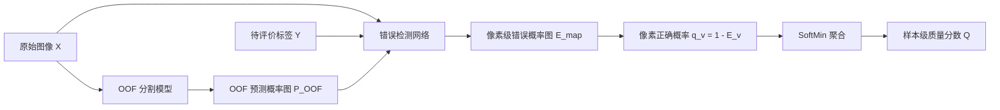
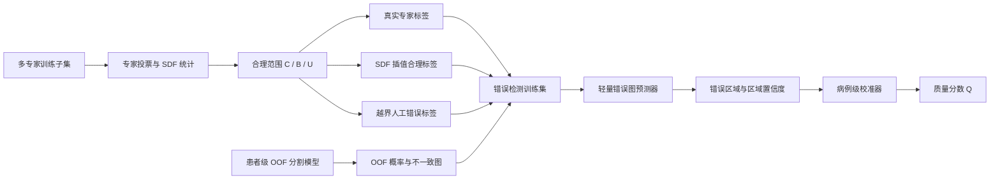

# 合理歧义标签构建与错误检测融合
> 研究对象：医学图像分割单标签质量评估  
> 核心目标：通过“合理歧义样本 + 人工错误样本”的对照训练，使模型学习标签差异是否超出合理专家范围，并同时输出错误区域与病例级质量分数。

## 1. 研究问题

给定医学图像 \(X\) 和唯一待评价标签 \(Y\)，最终部署目标是：

\[
(X,Y)\longrightarrow
\left\{
\hat E_{\mathrm{map}},
P_{\mathrm{err}},
Q,
C
\right\}
\]

其中：

- \(\hat E_{\mathrm{map}}\)：像素或体素级错误概率图；
- \(P_{\mathrm{err}}\)：病例包含实质性标签错误的概率；
- \(Q=1-P_{\mathrm{err}}\)：病例级标签质量分数；
- \(C\)：评价可信度，用于表示模型不足、域偏移或图像质量问题，不直接作为标签错误证据。

## 2. 核心假设

通过人工制造标签错误，可以得到错误位置真值，并将标签错误检测训练为空间预测任务。

此基础上增加一类训练数据：符合真实专家分歧范围的合理标签变化。

核心假设为：

> 在经典漏标、虚假区域和越界边界等人工错误之外，加入符合真实专家分歧分布的合理歧义标签作为困难非错误样本，可以减少错误检测器对合理专家差异的误报，同时保持对明显标签错误的检出能力。

期望模型学习：

\[
Q(X,Y_{\mathrm{expert}})
\approx
Q(X,Y_{\mathrm{amb}})
>
Q(X,Y_{\mathrm{error}})
\]

其中：

- \(Y_{\mathrm{expert}}\)：真实专家标签；
- \(Y_{\mathrm{amb}}\)：位于合理专家范围内的构造标签；
- \(Y_{\mathrm{error}}\)：明确超出合理范围的错误标签。

## 3. 总体流程

### 3.1 正向推理流程
部署时只需要原始图像、待评价标签和由原始图像得到的 OOF 预测概率图。合理歧义标签用于训练错误检测器，不作为正向推理时的额外输入。



对应关系为：

\[
P_{\mathrm{OOF}}=f_{\mathrm{OOF}}(X)
\]

\[
\hat E_{\mathrm{map}}
=g_\theta(X,Y,P_{\mathrm{OOF}})
\]

\[
Q=\operatorname{SoftMin}_v(1-\hat E_v)
\]

其中，原始 OOF-SoftMin 聚合的是 OOF 模型对候选标签的支持概率；本方法的 SoftMin-style 聚合对象是错误检测器给出的像素正确概率 \(1-\hat E_v\)，两者不能混为同一个分数。

### 3.2 训练数据构造与模型训练流程



## 4. 数据要求与划分

### 4.1 数据组成

推荐准备两部分数据：

1. **多专家校准子集**：同一图像至少有两份、最好有三份以上专家标签，用于估计合理标注范围；
2. **单标签主体数据**：每幅图像只有一个候选标签，用于最终部署与大规模质量排序。

多专家子集可以很小，但必须覆盖主要类别、常见大小和不同难度病例。

### 4.2 患者级划分

所有划分均以患者为单位，避免同一患者的切片或不同专家标签落入不同集合。

推荐使用：

- 训练集：构造合理标签和人工错误，并训练错误检测器；
- 校准集：选择投票阈值、错误阈值和病例级校准器；
- 测试集：只做最终评价，不调整规则或参数。

OOF 概率必须由未使用当前患者训练的分割模型产生。若采用五折交叉验证，则每个患者只使用对应留出折模型的预测。

## 5. 多专家合理标注范围构建

设同一图像有 \(M\) 份专家标签：

\[
Y^{(1)},Y^{(2)},\ldots,Y^{(M)}
\]

### 5.1 专家标签预检查

在计算合理范围前，先检查：

- 图像和标签空间是否严格对齐；
- 类别编码是否一致；
- 是否存在明显空标签、错位或文件损坏；
- 标签体积、连通分量数和拓扑是否为极端离群值；
- 标注者身份和标注规范是否可追溯。

不能默认所有专家差异都是合理歧义。若某一标签明显偏离其他标签且无法判断原因，将该病例标为 `UNRESOLVED`，不用于合理歧义监督。

### 5.2 专家投票概率图

对于二值分割，计算：

\[
p_v=\frac{1}{M}\sum_{m=1}^{M}Y_v^{(m)}
\]

其中 \(p_v\) 表示位置 \(v\) 被专家标为前景的比例。

使用两个阈值划分三个区域：

\[
C=\{v:p_v\ge \rho_{\mathrm{core}}\}
\]

\[
U=\{v:p_v\ge \rho_{\mathrm{support}}\}
\]

并要求：

\[
\rho_{\mathrm{core}}>\rho_{\mathrm{support}}
\]

三个区域的含义如下：

| 区域 | 定义 | 含义 | 标签构造约束 |
|---|---|---|---|
| 一致核心 \(C\) | 高专家支持区域 | 专家普遍认为应为前景 | 原则上必须保留 |
| 歧义带 \(B=U\setminus C\) | 部分专家支持区域 | 允许合理变化 | 可以改变 |
| 一致背景 \(\Omega\setminus U\) | 缺少专家支持区域 | 专家普遍认为应为背景 | 原则上不能添加前景 |

合理标签必须满足：

\[
C\subseteq Y_{\mathrm{amb}}\subseteq U
\]

阈值只能在训练集或校准集选择。多专家数量很少时，可以将专家交集和并集作为透明基线，但不能把专家并集或交集本身直接解释成新的真实专家标签。


## 6. 合理歧义标签的生成

合理歧义标签按可靠程度分为两级。

### 6.1 一级：直接使用真实专家标签

最可靠的合理样本是真实专家标签本身：

\[
Y_{\mathrm{amb}}=Y^{(m)}
\]

经预检查保留的不同专家标签均作为可接受标签参与训练。它们之间的差异不应自动标成错误。

验证时建议采用留一标注者策略：使用其他专家估计合理范围，再检查被留出的专家标签是否能够被方法接受。这样可以避免用候选标签自身定义其合理性。

### 6.2 二级：SDF 插值扩充

为增加合理标签数量，将两份非离群专家标签转换为有符号距离图：

\[
d_a=\operatorname{SDF}(Y^{(a)}),\qquad
d_b=\operatorname{SDF}(Y^{(b)})
\]

随机采样：

\[
\lambda\sim U(0,1)
\]

进行距离场插值：

\[
d_{\mathrm{amb}}=(1-\lambda)d_a+\lambda d_b
\]

重新二值化：

\[
Y_{\mathrm{amb}}=\mathbb{1}[d_{\mathrm{amb}}\le 0]
\]

相比直接对二值 mask 插值，SDF 插值能产生更连续的中间边界。第一版不进行逐像素独立随机采样，以避免产生锯齿、孔洞和散点。

每个病例先生成少量候选，例如从不同专家对中各采样一份；只有通过有效性检查的候选才进入训练集。

### 6.3 合理标签有效性检查

每份生成标签必须同时满足：

1. \(C\subseteq Y_{\mathrm{amb}}\subseteq U\)；
2. 体积位于非离群专家标签的经验范围内；
3. 连通分量数量未超出真实专家范围；
4. 不出现新的异常孔洞、断裂或孤立区域；
5. 边界表面距离未超过真实专家两两距离的校准分位数；
6. 对3D数据，相邻切片变化连续；
7. 不违反预先定义的简单解剖规则。

未通过检查的标签直接丢弃，不把它当作合理样本或错误样本。

## 7. 人工错误标签的生成

从一份已经通过检查的真实或合理标签 \(Y_{\mathrm{base}}\) 出发生成错误标签。

### 7.1 第一版错误类型

只保留几种含义清晰、容易控制的错误：

1. **核心区局部漏标**：从一致核心 \(C\) 中删除一个连续区域；
2. **目标或病灶漏标**：删除一个真实连通分量；
3. **远距离虚假区域**：在 \(U\) 外添加与目标不相连的前景；
4. **边界越界**：使局部边界明显超过专家支持范围；
5. **结构错误**：制造异常孔洞或断裂，作为可选错误类型。

若为多类别任务，可在第二阶段加入类别交换。第一版不需要同时覆盖所有错误类型。

### 7.2 错误位置真值

明确错误位置定义为：

\[
M_{\mathrm{pos}}(v)=
\mathbb{1}[Y_v=0\land v\in C]
\lor
\mathbb{1}[Y_v=1\land v\notin U]
\]

即：

- 候选标签漏掉专家一致核心：确定错误；
- 候选标签在专家支持范围外增加前景：确定错误；
- 候选标签只在歧义带内变化：不自动判错。

不要直接把 \(Y_{\mathrm{base}}\oplus Y_{\mathrm{candidate}}\) 全部当作错误，因为其中可能包含合理边界差异。

### 7.3 三值训练目标

使用错误、非错误和忽略三种状态：

\[
T_v=
\begin{cases}
1,&\text{明确超出合理范围}\\
0,&\text{明确属于合理标签或一致区域}\\
\text{ignore},&\text{证据不足或分歧性质不明}
\end{cases}
\]

以下情况建议设为 `ignore`：

- 仅一位专家标出的孤立小病灶；
- 无法区分合理存在性分歧与专家漏标的区域；
- 被判定为标注者离群但没有复核依据的区域；
- 超出第一版边界歧义定义的问题。

## 8. 单标签部署所需的歧义估计

训练阶段可以从多专家标签直接得到 \(A_v\)，但部署时只有 \((X,Y)\)，因此需要区分两个实验阶段。

### 8.1 阶段A：Oracle 歧义实验

在多专家测试子集上直接使用真实投票或 SDF 范围作为 \(A_v\)，先回答：

> 如果能够正确知道合理专家范围，歧义校准是否确实能减少合理标签误报？

这是最便宜的核心假设检验。如果 Oracle 歧义都没有稳定收益，不应立即训练复杂的歧义生成模型。

### 8.2 阶段B：学习图像条件歧义

只有阶段A成立后，再训练：

\[
h_\phi(X,P_{\mathrm{OOF}})\longrightarrow \hat A
\]

监督信号可以使用训练集上的专家投票分歧或 SDF 离散程度。最终在单标签数据上使用 \(\hat A\) 代替真实 \(A\)。

如果没有多专家数据，可以使用模型集成、随机预测或图像边界强度构造代理歧义，但必须称为“模型/规则歧义代理”，不能称为已学习的专家歧义。

## 9. OOF 不一致信号

由患者级 OOF 模型得到类别概率：

\[
P_{\mathrm{OOF}}(c\mid X,v)
\]

候选标签自置信度为：

\[
s_v=P_{\mathrm{OOF}}(y_v\mid X,v)
\]

定义不一致证据：

\[
D_v=1-s_v
\]

再使用歧义估计形成越界残差：

\[
R_v=\max(0,D_v-\tau_v)
\]

其中：

\[
\tau_v=h(A_v,\text{类别},\text{边界位置})
\]

第一版可以先用校准集分箱得到简单的 \(\tau_v\)，不必使用深层网络学习复杂权重。

## 10. 错误检测模型

### 10.1 输入

论文式基线输入：

\[
[X,Y,P_{\mathrm{OOF}},D]
\]

本研究主方法输入：

\[
[X,Y,P_{\mathrm{OOF}},D,A,R,\operatorname{SDF}(Y)]
\]

其中，主方法相对论文式基线的核心变化只有一个：显式提供合理歧义范围及越界残差。

### 10.2 模型形式

第一版使用轻量 U-Net 或现有分割主干增加一个二值错误图输出头：

\[
g_\theta(X,Y,P_{\mathrm{OOF}},D,A,R)
\longrightarrow \hat E_{\mathrm{map}}
\]

预测后对 \(\hat E_{\mathrm{map}}\) 阈值化并提取连通区域，即可得到错误候选区域。第一版不需要引入完整的 Mask R-CNN 或3D实例分割系统。

### 10.3 损失函数

像素级损失只在非 `ignore` 区域计算：

\[
L_{\mathrm{map}}
=
L_{\mathrm{BCE/Focal}}+L_{\mathrm{Dice}}
\]

若增加同病例质量排序，可使用：

\[
L_{\mathrm{rank}}
=
\max\left(0,m-Q(X,Y_{\mathrm{reasonable}})+Q(X,Y_{\mathrm{error}})\right)
\]

总损失为：

\[
L=L_{\mathrm{map}}+\lambda L_{\mathrm{rank}}
\]

第一轮先验证 \(L_{\mathrm{map}}\)。只有错误定位稳定后，再增加排序损失。

## 11. 从错误区域得到病例质量分数

错误图经过连通域分析后，得到候选区域 \(R_1,\ldots,R_K\)。每个区域提取：

- 区域平均或最大错误概率；
- 区域面积或体积；
- 区域占目标大小的比例；
- 到候选标签边界的距离；
- 是否位于目标内部、边界或远离目标；
- 是否可能对应整个目标漏标。

病例级特征可以定义为：

\[
z_{\mathrm{case}}=
[Q_{\mathrm{softmin}},\max_k p_k,\operatorname{TopKMean}(p_k),
\text{error-area-ratio},K]
\]

使用校准集上的逻辑回归或等距回归得到：

\[
P_{\mathrm{err}}=\operatorname{Calibrator}(z_{\mathrm{case}})
\]

最终定义：

\[
Q=1-P_{\mathrm{err}}
\]

错误严重度和评价可信度单独报告，不把它们机械合并进 \(Q\)。

## 12. 最小比较实验

第一轮只比较以下方法：

| 编号 | 方法 | 目的 |
|---|---|---|
| M0 | OOF-SoftMin | 病例级主 Baseline |
| M1 | OOF 不一致阈值 + 连通区域 | 非学习错误定位基线 |
| M2 | 论文式人工错误检测器 | 验证“造错学习”本身的收益 |
| M3 | 人工错误 + 合理歧义困难负样本 | 第一版主方法 |
| M4 | M3 + 学习得到的 \(\hat A\) | 单标签部署版本，仅在 Oracle 实验成立后进行 |

M2 与 M3 使用相同的网络、训练轮数、人工错误数量和错误严重度。二者唯一核心差异应是 M3 加入合理歧义样本和越界定义。

## 13. 评价指标

### 13.1 错误检测

- 像素或体素级 AUPRC；
- 连通区域级 AP；
- 区域错误召回率；
- 每病例错误候选数量；
- 每病例假阳性数量；
- Recall@固定复核预算。

### 13.2 病例质量评分

- 病例级 AUPRC 和 AUROC；
- Precision@K、Recall@K 和 Lift@K；
- 与人工错误严重度的 Spearman 相关；
- 若解释为概率，则报告 Brier Score 和 ECE。

### 13.3 核心科学指标

必须单独报告：

1. 真实专家标签或留出专家标签的误报率；
2. 歧义带内差异的误报率；
3. 高歧义病例中的严重错误召回率；
4. 一致核心漏标和支持范围外虚假区域的召回率。

## 14. 必做消融

1. OOF 预测与训练内预测；
2. 是否加入合理歧义样本；
3. 原始不一致 \(D\) 与越界残差 \(R\)；
4. 是否输入原始医学图像 \(X\)；
5. 真实专家标签与 SDF 插值标签；
6. 每次留出一种人工错误类型，只用其余类型训练。

如果去掉 \(X\) 后性能几乎不变，需要谨慎解释：检测器可能主要学习了人工错误的几何纹理，而不是医学图像证据。

## 15. 停止条件

出现以下情况时停止增加模型复杂度：

1. M2 不能稳定超过 M1：放弃学习型检测器，保留透明的阈值和连通区域方法；
2. M3 没有降低真实专家标签误报：合理歧义构造没有提供有效监督；
3. M3 降低误报但同时明显损害严重错误召回：合理范围过宽，需要修改范围定义；
4. 留出错误类型后性能大幅下降：模型记住了人工造错规则，不能声称具备真实错误泛化能力；
5. SDF 插值样本不能通过形状检查：只保留真实专家标签，不继续扩大合成合理样本；
6. Oracle 歧义没有收益：不训练复杂的歧义预测器；
7. 病例级联合评分不能提升固定预算下的 Precision@K：保留透明区域聚合，不增加质量评分网络。

## 16. 推荐实施顺序

### 阶段0：数据与 OOF 检查

- 完成患者级划分；
- 生成并缓存 OOF 概率；
- 复现 OOF-SoftMin；
- 检查图像、标签和概率图空间对齐。

### 阶段1：多专家范围与可视化

- 计算投票概率、歧义图、核心区和支持范围；
- 可视化真实专家边界及歧义带；
- 统计专家两两 Dice、表面距离、体积和连通分量；
- 排除无法解释的离群病例。

### 阶段2：构造配对训练样本

- 保留真实专家标签；
- 生成少量 SDF 插值标签；
- 生成数量匹配的人工错误标签；
- 保存候选标签、三值错误图、错误类型和严重度元数据。

### 阶段3：最小检测实验

- 完成 M1、M2 和 M3；
- 优先评价真实专家误报和严重错误召回；
- 做错误类型留出实验；
- 根据停止条件决定是否继续。

### 阶段4：单标签部署与质量校准

- 仅在阶段3结果支持核心假设后训练 \(\hat A(X)\)；
- 使用病例级校准器生成 \(P_{\mathrm{err}}\) 和 \(Q\)；
- 在完全独立的患者测试集上报告最终结果。

## 17. 建议的数据保存格式

每个训练样本至少保存：

```text
case_id
image_path
candidate_mask_path
oof_probability_path
ambiguity_map_path
error_target_path
target_state: reasonable | corrupted | unresolved
source_type: expert | sdf_interpolation | synthetic_error
error_type: none | deletion | spawn | boundary | topology
severity
rater_ids
fold_id
```

其中 `error_target` 使用：

- `1`：明确错误；
- `0`：明确非错误；
- `-1`：忽略，不参与损失。

## 18. 第一版伪代码

```python
for case in multi_rater_training_cases:
    image = load_image(case)
    expert_masks = load_and_validate_expert_masks(case)

    if expert_masks_are_unresolved(expert_masks):
        continue

    vote_prob = mean(expert_masks)
    core = vote_prob >= rho_core
    support = vote_prob >= rho_support
    ambiguity = 4 * vote_prob * (1 - vote_prob)

    reasonable_masks = list(expert_masks)
    reasonable_masks += generate_sdf_interpolations(expert_masks)
    reasonable_masks = [
        mask for mask in reasonable_masks
        if is_valid_reasonable_mask(mask, core, support, expert_masks)
    ]

    for mask in reasonable_masks:
        save_training_sample(
            image=image,
            candidate_mask=mask,
            ambiguity_map=ambiguity,
            error_target=zeros_like(mask),
            target_state="reasonable",
        )

        corrupted_mask = inject_out_of_range_error(mask, core, support)
        error_target = definite_violation_map(
            corrupted_mask, core, support
        )
        save_training_sample(
            image=image,
            candidate_mask=corrupted_mask,
            ambiguity_map=ambiguity,
            error_target=error_target,
            target_state="corrupted",
        )
```

## 19. 结果解释边界

第一版实验能够支持的结论是：

> 在受控数据和预定义人工错误条件下，加入基于多专家统计构造的合理歧义样本，是否能减少合理专家差异的误报，同时保持对明显越界错误的检测能力。

第一版实验不能单独支持：

- 已经能够可靠识别临床数据中的全部真实错误；
- 所有专家分歧都属于合理歧义；
- 生成标签完整覆盖真实专家标注分布；
- 模型输出可以替代医生复核。

## 20. 第一版最终交付物

1. 患者级 OOF 概率与 OOF-SoftMin 结果；
2. 多专家投票图、歧义图、核心区和支持范围；
3. 真实专家、SDF 插值、人工错误三类候选标签；
4. 三值错误位置真值；
5. M0-M3 的统一比较结果；
6. 合理专家标签误报与严重错误召回分析；
7. 错误类型留出实验；
8. 是否继续训练单标签歧义预测器的明确决策。
