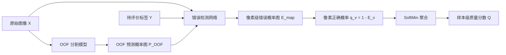

## 1. 第一版范围

第一版只做**增强腹部CT胰腺二值分割**。两个网络分阶段训练，不联合更新：

1. OOF分割网络生成独立的胰腺概率图；
2. 冻结并缓存概率图；
3. 错误检测网络使用图像、候选标签和OOF概率预测错误区域；
4. 在同域测试集验证方法，在外部数据集做零样本正向推理。

## 2. 网络选择

| 网络 | 具体选择 | 输入 | 输出 |
|---|---|---|---|
| OOF分割网络 | nnU-Net v2 `3d_fullres` | CT图像 \(X\) | 胰腺概率图 \(P\) |
| 错误检测网络 | 轻量3D U-Net，建议用 MONAI `DynUNet` | \([X,Y,P]\) 三通道 | 单通道错误概率图 \(\hat E_{map}\) |

选择理由：

- nnU-Net适合3D医学图像，可统一处理重采样、patch和五折训练，适合作为稳定的OOF分割基线；
- 错误检测本质是体素级二值分割，轻量3D U-Net已经足够，并能保留跨切片连续性；
- 第一版不使用Transformer、SAM或实例检测器，避免网络复杂度干扰监督设计的验证。

## 3. 数据集

| 用途 | 数据集 | 数据 | 使用方式 |
|---|---|---|---|
| 训练、校准和同域测试 | CURVAS | 90例增强腹部CT；每例有3位专家的胰腺、肾脏、肝脏标签 | 第一版只取胰腺，重新做患者级60/10/20划分 |
| 外部正向推理 | QUBIQ 2021胰腺子集 | 38名患者、76次CT扫描；每次扫描有2份胰腺标签 | 不训练、不微调、不重新选阈值；分别给两份专家标签打分 |

选择CURVAS的原因：

- 3份专家标签可以直接构建一致核心、歧义带和专家支持范围；
- 胰腺边界存在明显专家差异，适合检验合理差异是否被误报；
- 图像和标签均为3D NIfTI，能直接训练3D网络。

选择QUBIQ胰腺的原因：

- 与训练任务同为腹部CT胰腺分割，类别和模态能够对齐；
- 来自不同数据源，可检验跨数据集迁移；
- 有两份专家标签，可比较真实专家标签与其人工错误版本的得分。

QUBIQ只有两位标注者，不足以独立估计稳定的专家范围，因此外部实验主要评价排序和迁移，不单独把它作为合理范围真值。

## 4. CURVAS数据划分

按患者划分，并尽量保持不同病例难度在三部分中的比例一致：

| 子集 | 数量 | 用途 |
|---|---:|---|
| 训练集 | 60例 | 生成OOF概率、构造训练样本、训练错误检测器 |
| 校准集 | 10例 | 选择错误阈值、SoftMin参数和病例级校准器 |
| 测试集 | 20例 | 同域最终评价，不调参 |

同一患者的图像、三份专家标签及所有合成变体必须处于同一子集。

## 5. 训练顺序

### 步骤0：预处理与固定划分

1. 统一图像方向、spacing、强度截断和归一化；
2. 检查三份标签与图像是否严格对齐；
3. 保存一次固定的60/10/20患者列表，后续所有方法共用。

### 步骤1：训练OOF分割网络

在60例训练患者内部做5折，每折约48例训练、12例留出。分割监督使用训练患者三位专家的多数投票胰腺标签。

对第 \(k\) 折留出患者，只能使用未见过这些患者的模型生成概率：

\[
P_{\mathrm{OOF},i}=f_k(X_i),\qquad i\in\mathrm{fold}_k
\]

五折完成后，60例训练患者各有一份无患者泄漏的OOF概率图。概率图按原始病例空间保存，不能只保存二值结果。

### 步骤2：构造错误检测训练样本

对每个训练患者计算专家投票，并得到：

- 一致核心 \(C\)：专家普遍认为是胰腺；
- 歧义带 \(B\)：专家存在分歧；
- 支持范围 \(U\)：至少达到最低专家支持的位置。

候选标签包括：

1. 三份真实专家标签，作为合理非错误样本；
2. 可选的少量SDF插值标签，只有通过形状和边界检查后才使用；
3. 人工错误标签：核心区局部删除、支持范围外添加、明显边界越界。

错误监督使用三值目标：`1=明确错误`、`0=明确非错误`、`-1=证据不足并忽略`。歧义带内的专家差异不自动标为错误。

同一患者的所有候选标签共享同一份 \(X\) 和 \(P_{\mathrm{OOF}}\)。

### 步骤3：训练错误检测网络

输入和输出为：

\[
\hat E_{map}=g_\theta(X,Y,P_{\mathrm{OOF}})
\]

建议初始配置：输入3通道、输出1通道，基础通道数16，损失使用忽略 `-1` 区域的 `BCE + Dice`。

训练错误检测器时，OOF模型及缓存概率全部冻结，不允许错误检测损失反向更新分割网络。

### 步骤4：校准

使用5个折模型分别预测10例校准患者并取概率平均。校准集只用于：

- 选择错误图阈值；
- 选择SoftMin参数；
- 将区域特征校准为病例级 \(P_{err}\)。

### 步骤5：同域测试

对20例测试患者使用相同的五折概率平均和固定阈值，报告：

- 真实专家标签误报率；
- 严重人工错误召回率；
- 体素级AUPRC和区域级召回；
- 固定复核预算下的Precision@K或Recall@K。

### 步骤6：QUBIQ外部推理

五个分割模型分别预测外部CT并求平均：

\[
P_{\mathrm{ext}}=\frac{1}{5}\sum_{k=1}^{5}f_k(X_{\mathrm{ext}})
\]

然后使用固定的错误检测器：

\[
\hat E_{map}=g_\theta(X_{\mathrm{ext}},Y_{\mathrm{ext}},P_{\mathrm{ext}})
\]

外部数据不参与训练、微调或阈值选择。外部预测应称为 \(P_{\mathrm{ext}}\)，不称为该数据集上的OOF预测。

## 6. 第一版比较

| 方法 | 内容 |
|---|---|
| M0 | OOF-SoftMin病例级基线 |
| M1 | OOF不一致阈值加连通区域 |
| M2 | 轻量3D U-Net，使用人工错误训练 |
| M3 | 与M2相同网络，增加真实专家合理标签和可用的SDF合理标签 |

M2与M3必须使用相同的OOF概率、人工错误、网络、训练轮数和随机种子。第一版成立的主要标准是：

\[
FPR_{reasonable}(M3)<FPR_{reasonable}(M2)
\]

同时严重错误召回不能明显下降。

## 7. 必须保持的边界

- 多专家信息只用于构造训练监督，正向推理输入保持为 \(X,Y,P\)；
- OOF概率必须来自未见过当前训练患者的分割模型；
- 校准集和测试集不能参与任一网络训练；
- 外部图像上的模型不一致可能来自域偏移，不能直接解释为标签错误；
- 第一版结论限定为受控人工错误和真实专家标签上的检测效果。

## 8. 数据来源

- [CURVAS官方数据](https://zenodo.org/records/13767408)
- [CURVAS数据说明论文](https://www.nature.com/articles/s41597-025-06473-9)
- [QUBIQ 2021官方数据说明](https://qubiq21.grand-challenge.org/participation/)

